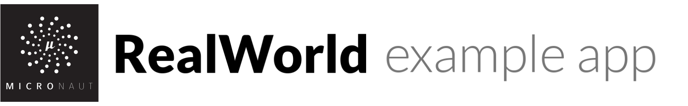

# 

> ### micronaut + MyBatis codebase containing real world examples  (auth so far) that adheres to the [RealWorld](https://github.com/gothinkster/realworld-example-apps) spec and API.

This codebase is work in progress. At first commit. This codebase is to showcase a fully fledged fullstack application built with micronautfw + Mybatis including Swagger OpenAPI API operations, authentication with JWT, and more. 

For more information on how to this works with other frontends/backends, head over to the [RealWorld](https://github.com/gothinkster/realworld) repo.

# What it is similar to?

The idea is to make the copy of [Spring Boot Real World App](https://github.com/gothinkster/spring-boot-realworld-example-app) but not exact. Since a) Spring Boot is the most popular framework and many Java devs are familiar with it b) I am still learning micronaut, hence it is mimicking the same app for easy inspiration. Micronaut also try doing the same. And mentions that in its [docs](https://docs.micronaut.io/snapshot/guide/index.html#ioc). No doubt, the things will change and where appropriate more micronaut-ish. 

# How it works

The application uses [Micronautfw](https://micronaut.io).

* Use the idea of Domain Driven Design to separate the business term and infrastruture term. 
* Use MyBatis to implement the [Data Mapper](https://martinfowler.com/eaaCatalog/dataMapper.html) pattern for persistence.
* [CQRS](https://martinfowler.com/bliki/CQRS.html) pattern - Not yet done.

# Micronaut features and guides used

The following features and guides have been used / explored so far:

* [Access a database with JPA and Hibernate](https://guides.micronaut.io/micronaut-data-access-jpa-hibernate/guide/index.html)
* [Micronaut JWT Authentication](https://guides.micronaut.io/micronaut-security-jwt/guide/index.html)
* [Micronaut Open API](https://github.com/micronaut-projects/micronaut-openapi)
* More to Come...

# Getting started

You need Java installed.

    ./gradlew bootRun
    open http://localhost:8080

# Additional References

Work in Progress List...

* [Very simplified insurance sales system made in a microservices architecture using Micronaut](https://github.com/asc-lab/micronaut-microservices-poc)

# Help

Please fork and PR to improve the code.
